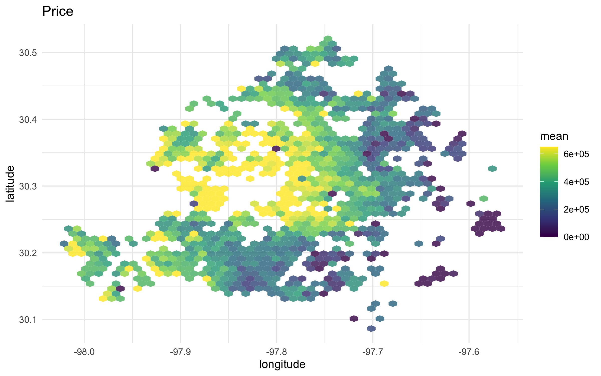
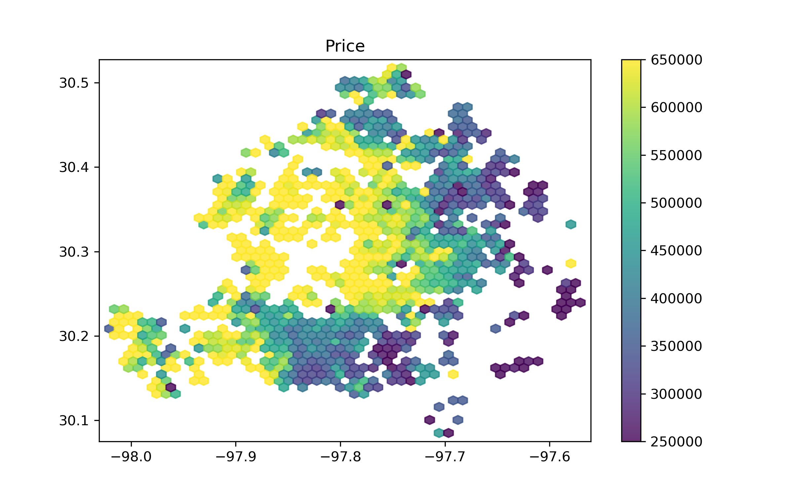
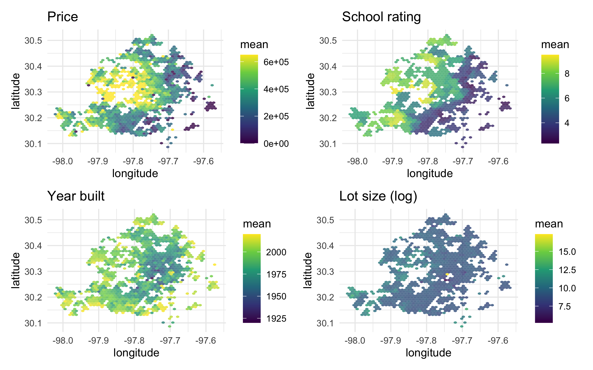
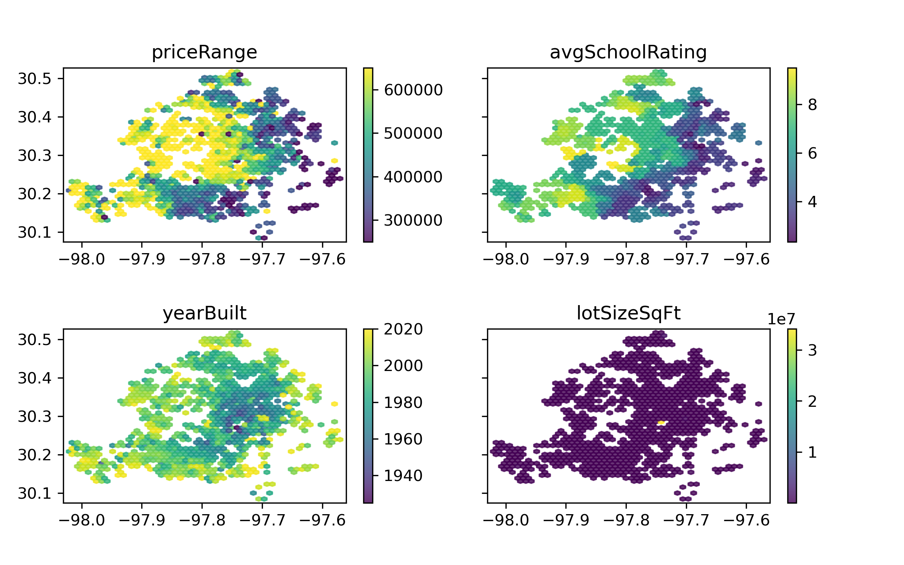

Predict housing prices in Austin TX with tidymodels and xgboost
================

Original notebook <https://juliasilge.com/blog/austin-housing/>.

# Explore data

``` r
# r
library(tidyverse)
train_raw <- read_csv("train.csv")

train_raw %>%
  count(priceRange)
```

    ## # A tibble: 5 × 2
    ##   priceRange        n
    ##   <chr>         <int>
    ## 1 0-250000       1249
    ## 2 250000-350000  2356
    ## 3 350000-450000  2301
    ## 4 450000-650000  2275
    ## 5 650000+        1819

``` python
# py
import pandas as pd
import numpy as np
import matplotlib.pyplot as plt
import seaborn as sns

train_raw = pd.read_csv("train.csv")

train_raw.groupby("priceRange")["priceRange"].count()
```

    ## priceRange
    ## 0-250000         1249
    ## 250000-350000    2356
    ## 350000-450000    2301
    ## 450000-650000    2275
    ## 650000+          1819
    ## Name: priceRange, dtype: int64

## Price distribution

``` r
# r
price_plot <-
  train_raw %>%
  mutate(priceRange = parse_number(priceRange)) %>%
  ggplot(aes(longitude, latitude, z = priceRange)) +
  stat_summary_hex(alpha = 0.8, bins = 50) +
  scale_fill_viridis_c() +
  labs(
    fill = "mean",
    title = "Price"
  )

price_plot
```

<!-- -->

``` python
# py
def clean_price_range(num): 
  return int(num.split("-")[-1].replace("+",""))

p_df = train_raw.copy()
p_df["priceRange"] = (
  train_raw["priceRange"]
  .apply(lambda x: clean_price_range(x))
  )

plt.cla()
palette = sns.color_palette("viridis", as_cmap=True)
sns.jointplot(
  data = p_df, 
  x="longitude", y="latitude", 
  hue="priceRange",
  cmap="viridis",
  palette=palette
  )
```

    ## <seaborn.axisgrid.JointGrid object at 0x1539e0040>

``` python
plt.title("Price")
plt.show()
```



## More information with charts

``` r
# r
plot_austin <- function(var, title) {
  train_raw %>%
    ggplot(aes(longitude, latitude, z = {{ var }})) +
    stat_summary_hex(alpha = 0.8, bins = 50) +
    scale_fill_viridis_c() +
    labs(
      fill = "mean",
      title = title
    )
}

library(patchwork)
(price_plot + plot_austin(avgSchoolRating, "School rating")) /
  (plot_austin(yearBuilt, "Year built") + plot_austin(log(lotSizeSqFt), "Lot size (log)"))
```

<!-- -->

``` python
# py
def plot_austin(var, title): 
  sns.jointplot(
    data = p_df, 
    x="longitude", y="latitude", 
    hue=var,
    cmap="viridis",
    palette=palette
  )
  plt.title(title)
  # plt.show()

plt.cla()
fig, (ax1, ax2) = plt.subplots(2, 2)

# 1
plt.subplot(1, 2, 1)
plot_austin("avgSchoolRating", "School rating")

# 2
plt.subplot(1, 2, 2)
plot_austin("avgSchoolRating", "School rating")

# 3
plt.subplot(1, 1, 1)
plot_austin("avgSchoolRating", "School rating")

# 4
plt.subplot(2, 2, 1)
plot_austin("avgSchoolRating", "School rating")
plt.show()
```


