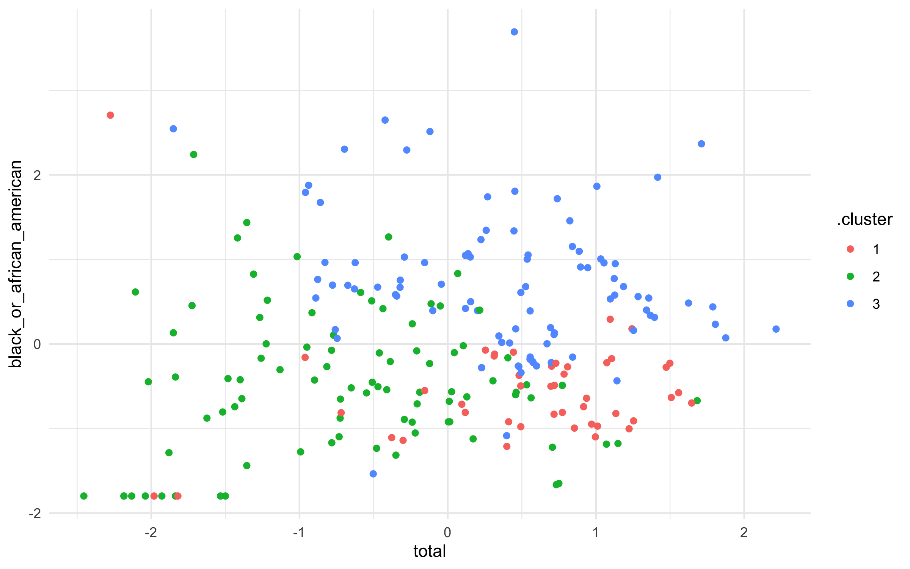
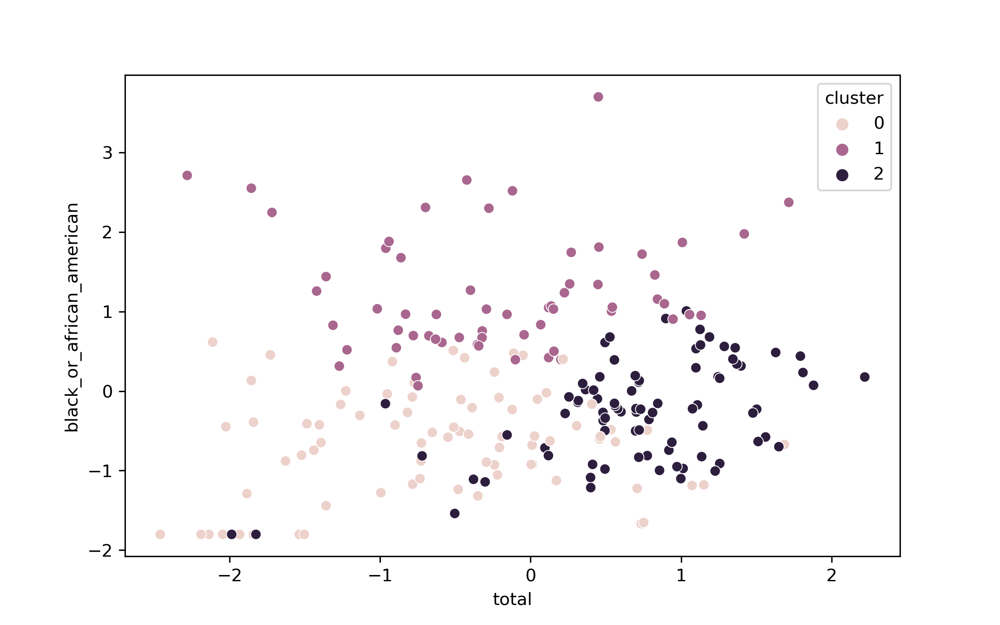
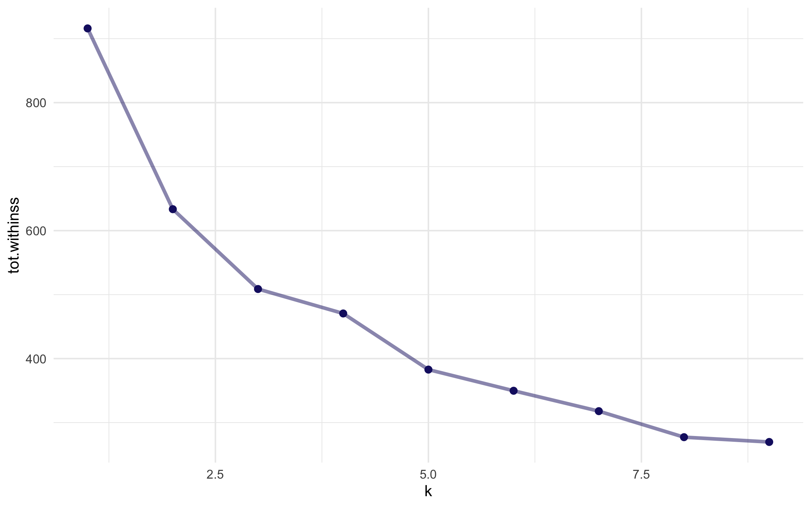
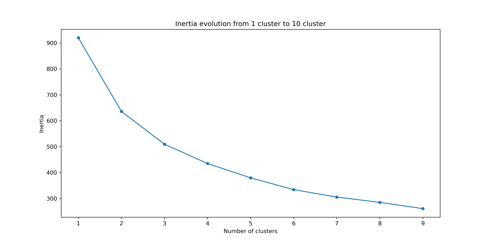

K-Means and employment status
================

Original notebook <https://juliasilge.com/blog/kmeans-employment/>.

# Explore the data

``` r
# r
library(tidyverse)

employed <- read_csv("https://raw.githubusercontent.com/rfordatascience/tidytuesday/master/data/2021/2021-02-23/employed.csv")
```

``` python
# py
import pandas as pd
import numpy as np
import matplotlib.pyplot as plt
import seaborn as sns

employed = pd.read_csv("https://raw.githubusercontent.com/rfordatascience/tidytuesday/master/data/2021/2021-02-23/employed.csv")
```

## Focusing on the industry and occupation

``` r
# r
employed_tidy <-
employed %>%
  filter(!is.na(employ_n)) %>%
  group_by(occupation = paste(industry, minor_occupation), race_gender) %>%
  summarise(n = mean(employ_n)) %>%
  ungroup()

employed_tidy %>% 
  head() %>% 
  kable()
```

| occupation                                                      | race\_gender              |          n |
|:----------------------------------------------------------------|:--------------------------|-----------:|
| Agriculture and related Construction and extraction occupations | Asian                     |   333.3333 |
| Agriculture and related Construction and extraction occupations | Black or African American |  1000.0000 |
| Agriculture and related Construction and extraction occupations | Men                       | 11833.3333 |
| Agriculture and related Construction and extraction occupations | TOTAL                     | 12166.6667 |
| Agriculture and related Construction and extraction occupations | White                     | 10500.0000 |
| Agriculture and related Construction and extraction occupations | Women                     |   333.3333 |

``` python
# py
employed_tidy = (
employed
  .loc[employed.employ_n.notnull()]
  .assign(occupation = lambda x: x["industry"] + x["minor_occupation"])
  .groupby(["occupation","race_gender"])
  .agg(n = ("employ_n","mean"))
  .reset_index()
)
```

``` r
kable(py$employed_tidy %>% head())
```

| occupation                                                     | race\_gender              |          n |
|:---------------------------------------------------------------|:--------------------------|-----------:|
| Agriculture and relatedConstruction and extraction occupations | Asian                     |   333.3333 |
| Agriculture and relatedConstruction and extraction occupations | Black or African American |  1000.0000 |
| Agriculture and relatedConstruction and extraction occupations | Men                       | 11833.3333 |
| Agriculture and relatedConstruction and extraction occupations | TOTAL                     | 12166.6667 |
| Agriculture and relatedConstruction and extraction occupations | White                     | 10500.0000 |
| Agriculture and relatedConstruction and extraction occupations | Women                     |   333.3333 |

## Prepare data for k-means

``` r
# r
employment_demo <- employed_tidy %>%
  filter(race_gender %in% c("Women", "Black or African American", "Asian")) %>%
  pivot_wider(names_from = race_gender, values_from = n, values_fill = 0) %>%
  janitor::clean_names() %>%
  left_join(employed_tidy %>%
    filter(race_gender == "TOTAL") %>%
    select(-race_gender) %>%
    rename(total = n)) %>%
  filter(total > 1e3) %>%
  mutate(across(c(asian, black_or_african_american, women), ~ . / (total)),
    total = log(total),
    across(where(is.numeric), ~ as.numeric(scale(.)))
  ) %>%
  mutate(occupation = snakecase::to_snake_case(occupation))

employment_demo %>% head() %>% kable()
```

| occupation                                                                                 |      asian | black\_or\_african\_american |      women |      total |
|:-------------------------------------------------------------------------------------------|-----------:|-----------------------------:|-----------:|-----------:|
| agriculture\_and\_related\_construction\_and\_extraction\_occupations                      | -0.5527621 |                   -0.4101237 | -1.3062012 | -1.4824125 |
| agriculture\_and\_related\_farming\_fishing\_and\_forestry\_occupations                    | -0.9425167 |                   -1.2216272 | -0.5087576 |  0.7062658 |
| agriculture\_and\_related\_installation\_maintenance\_and\_repair\_occupations             | -0.8983730 |                   -1.2760961 | -1.3804851 | -0.9922827 |
| agriculture\_and\_related\_manage\_ment\_business\_and\_financial\_operations\_occupations | -1.0589163 |                   -1.6644753 | -0.2910764 |  0.7325639 |
| agriculture\_and\_related\_management\_business\_and\_financial\_operations\_occupations   | -1.0575615 |                   -1.6495961 | -0.2995603 |  0.7498726 |
| agriculture\_and\_related\_office\_and\_administrative\_support\_occupations               | -0.6713979 |                   -1.5361356 |  2.2296749 | -0.5026994 |

``` python
# py
df1 = (
employed_tidy
  .query("race_gender == ['Women', 'Black or African American', 'Asian']")
  .pivot(index = "occupation", columns = "race_gender", values = "n")
  .fillna(0)
  .rename(columns = lambda x: x.replace(" ", "_").lower())
  .reset_index()
  .merge(
    employed_tidy
      .query("race_gender == 'TOTAL'")
      .drop(columns = ["race_gender"])
      .rename(columns={"n":"total"}),
    on = "occupation",
    how = "left"
  )
  .query("total > 1e3")
  .assign(
    occupation = lambda x: (
      x["occupation"]
      .str.lower()
      .str.replace(r'[^\w\s]+', '', regex=True)
      .str.replace(" ","_"))
    )
)


def div_total(col, total): 
  return col / total

def scaler(col): 
  return (col-np.mean(col))/np.std(col)

df2 = (
df1
  [["asian","black_or_african_american","women","total"]]
  .apply(lambda x: div_total(x, x["total"]), axis=1)
  .drop(columns=["total"])
  .assign(total = np.log(df1["total"]))
  .apply(lambda x: scaler(x), axis=0)
)

employment_demo = (
pd.concat(
  [df1.drop(columns=["asian","women", "black_or_african_american","total"]), df2],
  axis = 1
  )
)
```

``` r
py$employment_demo %>% head() %>% kable()
```

|     | occupation                                                                             |      asian | black\_or\_african\_american |      women |      total |
|:----|:---------------------------------------------------------------------------------------|-----------:|-----------------------------:|-----------:|-----------:|
| 0   | agriculture\_and\_relatedconstruction\_and\_extraction\_occupations                    | -0.5539676 |                   -0.4110182 | -1.3090500 | -1.4856457 |
| 1   | agriculture\_and\_relatedfarming\_fishing\_and\_forestry\_occupations                  | -0.9445724 |                   -1.2242916 | -0.5098673 |  0.7078062 |
| 2   | agriculture\_and\_relatedinstallation\_maintenance\_and\_repair\_occupations           | -0.9003323 |                   -1.2788793 | -1.3834959 | -0.9944469 |
| 3   | agriculture\_and\_relatedmanagement\_business\_and\_financial\_operations\_occupations | -1.0612259 |                   -1.6681056 | -0.2917112 |  0.7341616 |
| 4   | agriculture\_and\_relatedmanagement\_business\_and\_financial\_operations\_occupations | -1.0598681 |                   -1.6531939 | -0.3002136 |  0.7515081 |
| 5   | agriculture\_and\_relatedoffice\_and\_administrative\_support\_occupations             | -0.6728622 |                   -1.5394859 |  2.2345379 | -0.5037958 |

# Implement k-means clustering

``` r
# r
set.seed(123)
employment_clust <- kmeans(select(employment_demo, -occupation), centers = 3)
summary(employment_clust)
```

    ##              Length Class  Mode   
    ## cluster      230    -none- numeric
    ## centers       12    -none- numeric
    ## totss          1    -none- numeric
    ## withinss       3    -none- numeric
    ## tot.withinss   1    -none- numeric
    ## betweenss      1    -none- numeric
    ## size           3    -none- numeric
    ## iter           1    -none- numeric
    ## ifault         1    -none- numeric

``` r
library(broom)
tidy(employment_clust)
```

    ## # A tibble: 3 × 7
    ##      asian black_or_african_american  women  total  size withinss cluster
    ##      <dbl>                     <dbl>  <dbl>  <dbl> <int>    <dbl> <fct>  
    ## 1  1.46                       -0.551  0.385  0.503    45     125. 1      
    ## 2 -0.732                      -0.454 -0.820 -0.655    91     189. 2      
    ## 3  0.00978                     0.704  0.610  0.393    94     211. 3

``` python
# py
np.random.seed(123)
from sklearn.cluster import KMeans
kmeans = KMeans(n_clusters = 3)

kmeans_data = employment_demo.drop(columns=["occupation"]) 
kmeans.fit(kmeans_data)
```

    ## KMeans(n_clusters=3)

``` python
pd.DataFrame(
  kmeans.cluster_centers_, 
  columns=kmeans_data.columns
  )
```

    ##       asian  black_or_african_american     women     total
    ## 0 -0.778532                  -0.653583 -0.870729 -0.603064
    ## 1 -0.067400                   1.214683  0.160586 -0.233135
    ## 2  0.755243                  -0.261633  0.678432  0.712494

## Visualise kmeans

``` r
# r
augment(employment_clust, employment_demo) %>%
  ggplot(aes(total, black_or_african_american, color = .cluster)) +
  geom_point()
```

<!-- -->

``` python
# py
p_df = kmeans_data.assign(cluster = kmeans.predict(kmeans_data))

plt.cla()
sns.scatterplot(data=p_df, y="black_or_african_american", x="total", hue="cluster")
plt.show()
```



# Choosing k

``` r
# r
kclusts <-
  tibble(k = 1:9) %>%
  mutate(
    kclust = map(k, ~ kmeans(select(employment_demo, -occupation), .x)),
    glanced = map(kclust, glance),
  )

kclusts %>%
  unnest(cols = c(glanced)) %>%
  ggplot(aes(k, tot.withinss)) +
  geom_line(alpha = 0.5, size = 1.2, color = "midnightblue") +
  geom_point(size = 2, color = "midnightblue")
```

<!-- -->

``` python
# py
max_k = 10
inertia = []

for k in range(1, max_k): 
    inertia.append(KMeans(n_clusters=k).fit(kmeans_data).inertia_)

fig, ax = plt.subplots(figsize=(12, 6))
plt.title(f'Inertia evolution from 1 cluster to {max_k} cluster')
sns.lineplot(x=range(1, max_k), y=inertia)
sns.scatterplot(x=range(1, max_k), y=inertia)
plt.xlabel('Number of clusters')
plt.ylabel('Inertia')
plt.show()
```


\#\# Deciding final cluster

``` r
# r
final_clust <- kmeans(select(employment_demo, -occupation), centers = 5)
```

``` python
# py
kmeans = KMeans(n_clusters = 5)
final_clust = kmeans.fit(employment_demo.drop(columns=["occupation"]))
```
